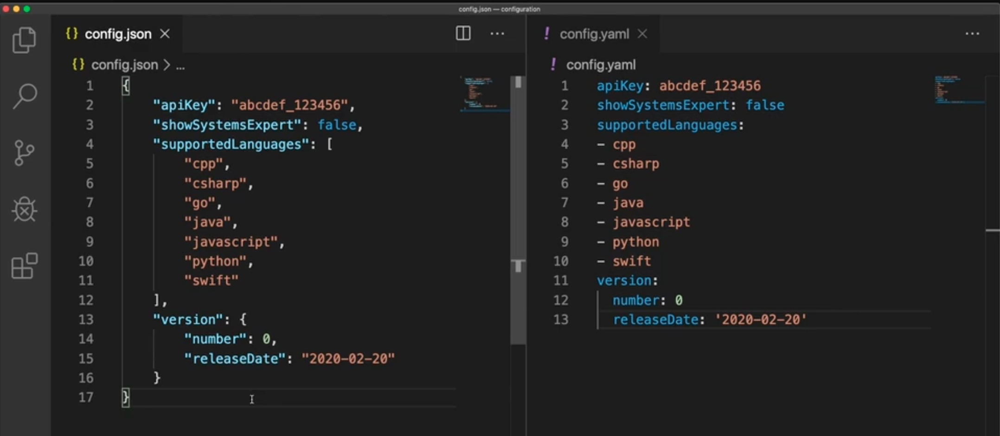

# Configuration  
Configuration is a set of parameters or constants that your system or application will use. Rather than having these config details in your application, they are typically placed in a separate file for reference. Examples of details that may be included in a config file include: apiKey, supportedLanguages, version, etc. Config file formats are typically dependent on the team designing the system. 

With __static configuration__, if you need to submit a change to your config file, the entire application needs to redeploy with the config file. This typically requires robust testing and auditing of any changes made. 

__Dynamic configuration__ allows programmers to make changes to the configuration file that are immediately reflected in the application. This is helpful when wanting to quickly deploy new features, but harmful if quickly made changes cause negative impacts to the application. Large companies are able to partition dynamic configuration changes to a small number of users to test the changes before deploying more broadly to all users.

## Prerequisites  
* JSON
* YAML
* Key-Value Store

## Key Term  
### Configuration  
A set of parameters or constants that are critical to a system. Configuration is typically written in __JSON__ or __YAML__ and can be either __static__, meaning that it's hard-coded in and shipped with your system's application code (like frontend code, for instance), or __dynamic__, meaning that it lives outside of your system's application code.