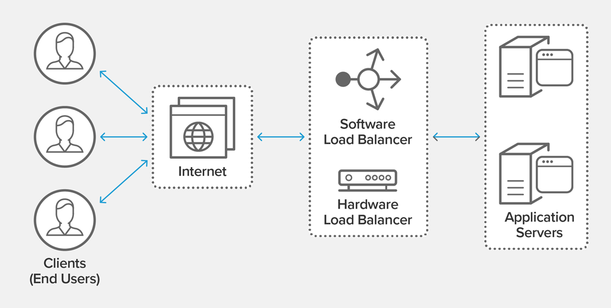

# Load Balancers  
Load balancing refers to efficiently distributing incoming network traffic across a group of backend servers, also known as a server farm or server pool.

Modern high‑traffic websites must serve hundreds of thousands, if not millions, of concurrent requests from users or clients and return the correct text, images, video, or application data, all in a fast and reliable manner. To cost‑effectively scale to meet these high volumes, modern computing best practice generally requires adding more servers.

A load balancer acts as the “traffic cop” sitting in front of your servers and routing client requests across all servers capable of fulfilling those requests in a manner that maximizes speed and capacity utilization and ensures that no one server is overworked, which could degrade performance. If a single server goes down, the load balancer redirects traffic to the remaining online servers. When a new server is added to the server group, the load balancer automatically starts to send requests to it.

Load balancers can be used between clients and servers, servers and databases, and even at the DNS layer.

In this manner, a load balancer performs the following functions:
* Distributes client requests or network load efficiently across multiple servers
* Ensures high availability and reliability by sending requests only to servers that are online
* Provides the flexibility to add or subtract servers as demand dictates

### Load Balancer Algorithms
Different load balancing algorithms provide different benefits; the choice of load balancing method depends on your needs:
* __Round Robin__ – Requests are distributed across the group of servers sequentially.
* __Least Connections__ – A new request is sent to the server with the fewest current connections to clients. The relative computing capacity of each server is factored into determining which one has the least connections.
* __Hash__ – Distributes requests based on a key you define, such as the client IP address or
the request URL.
* __Path Based__ - All requests made towards a specific path will be directed to their own set of servers.

## Prerequisites  
* Reverse Proxy

## Key Terms  
### Load Balancer  
A type of __reverse proxy__ that distributes traffic across servers. Load balancers can be found in many parts of a system, from the DNS layer all the way to the database layer.  

### Server-Selection Strategy  
How a __load balancer__ chooses servers when distributing traffic amongst multiple servers. Commonly used strategies include round-robin, random selection, performance-based selection (choosing the server with the best performance metrics, like the fastest response time or the least amount of traffic), and IP-based routing.

### Hot Spot  
When distributing a workload across a set of servers, that workload might be spread unevenly. This can happen if your __sharding key__ or you __hashing function__ are suboptimal, or if your workload is naturally skewed: some servers will receive a lot more traffic than others, thus creating a "hot spot".  

### Nginx ☆  
Pronounced "engine X" - not "N jinx", Nginx is a very popular webserver that's often used as a __reverse proxy__ and __load balancer__. Website: [http://www.nginx.com/](https://www.nginx.com/)