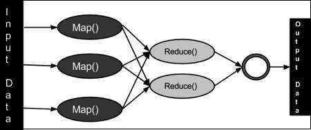

# MapReduce  
MapReduce is a framework using which we can write applications to process huge amounts of data, in parallel, on large clusters of commodity hardware in a reliable manner.  

__What is MapReduce?__
MapReduce is a processing technique and a program model for distributed computing based on java. The MapReduce algorithm contains two important tasks, namely Map and Reduce. Map takes a set of data and converts it into another set of data, where individual elements are broken down into tuples (key/value pairs). Secondly, reduce task, which takes the output from a map as an input and combines those data tuples into a smaller set of tuples. As the sequence of the name MapReduce implies, the reduce task is always performed after the map job.  

The major advantage of MapReduce is that it is easy to scale data processing over multiple computing nodes. Under the MapReduce model, the data processing primitives are called mappers and reducers. Decomposing a data processing application into mappers and reducers is sometimes nontrivial. But, once we write an application in the MapReduce form, scaling the application to run over hundreds, thousands, or even tens of thousands of machines in a cluster is merely a configuration change. This simple scalability is what has attracted many programmers to use the MapReduce model.  

__The Algorithm__  
* Generally MapReduce paradigm is based on sending the computer to where the data resides.  
* MapReduce program executes in three stages, namely map stage, shuffle stage, and reduce stage.  
  * __Map stage__ − The map or mapper’s job is to process the input data. Generally the input data is in the form of file or directory and is stored in the Hadoop file system (HDFS). The input file is passed to the mapper function line by line. The mapper processes the data and creates several small chunks of data.  
  * __Reduce stage__ − This stage is the combination of the Shuffle stage and the Reduce stage. The Reducer’s job is to process the data that comes from the mapper. After processing, it produces a new set of output, which will be stored in the HDFS.  
* During a MapReduce job, Hadoop sends the Map and Reduce tasks to the appropriate servers in the cluster.  
* The framework manages all the details of data-passing such as issuing tasks, verifying task completion, and copying data around the cluster between the nodes.  
* Most of the computing takes place on nodes with data on local disks that reduces the network traffic.  
* After completion of the given tasks, the cluster collects and reduces the data to form an appropriate result, and sends it back to the Hadoop server.

## Prerequisites  
* File System  
* Idempotent Operation  

## Key Terms  
### MapReduce  
A popular framework for processing very large datasets in a distributed setting efficiently, quickly, and in a fault-tolerant manner. A MapReduce job is comprised of 3 main steps:  
* the __Map__ step, which runs a __map function__ on the various chunks of the dataset and transforms these chunks into intermediate __key-value pairs__.  
* the __Shuffle__ step, which reorganizes the intermediate __key-value pairs__ such that pairs of the same key are routed to the same machine in the final step.  
* the __Reduce__ step, which runs a __reduce function__ on the newly shuffled __key-value pairs__ and transforms them into more meaningful data.  

The canonical example of a MapReduce use case is counting the number of occurences of words in a large text file.  

When dealing with a MapReduce library, engineers and/or systems administrators only need to worry about the map and reduce functions, as well as their inputs and outputs. All other concerns, including the parallelization of tasks and the fault-tolerance of the MapReduce job, are abstracted away and taken care of by the MapReduce implementation.  

### Distributed File System  
A Distributed File System is an abstraction over a (usually large) cluster of machines that allow them to act like one large file system. The two most popular implementations of a DFS are the __Google File System__ (GFS) and the __Hadoop Distributed File System__ (HDFS).  

Typically, DFSs take care of the classic __availability__ and __replication__ guarantees that can be tricky to obtain in a distributed-system setting. The overarching idea is that files are split into chunks of a certain size (4MB or 64MB, for instance), and those chunks are sharded across a large cluster of machines. A central control plane is in charge of deciding where each chunk resides, routing reads to the right nodes, and handling communication between machines.  

Different DFS implementations have slightly different APIs and semantics, but they achieve the same common goal: extremely large-scale persistent storage.  

### Hadoop ☆  
A popular, open-source framework that supports MapReduce jobs and many other kinds of data-processing pipelines. Its central component is __HDFS__ (Hadoop Distributed File System), on top of which other technologies have been developed.  
Website: <https://hadoop.apache.org/>