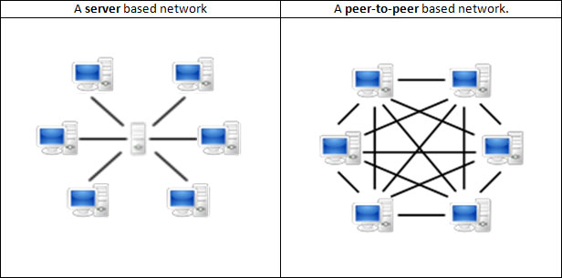

# Peer-To-Peer Networks
Peer-to-peer (P2P) computing or networking is a distributed application architecture that partitions tasks or workloads between peers. Peers are equally privileged, equipotent participants in the application. They are said to form a peer-to-peer network of nodes. 

Peers make a portion of their resources, such as processing power, disk storage or nework bandwidth, directly available to other network participants, without the need for central coordination by servers or stable hosts. Peers are both suppliers and consumers of resources, in contrast to the traditional client-server model in which the consumption and supply of resources is divided. 

Peer-to-peer networks are commonly used in decentralized applications like cryptocurrencies and blockchain applications.

## Prerequisites  
* Client-Server Model
* Throughput

## Key Terms  
### Peer-To-Peer Network  
A collection of machines referred to as peers that divide a workload between themselves to presumably complete the workload faster than would otherwise be possible. Peer-to-peer networks are often used in file-distribution systems.  

### Gossip Protocol  
When a set of machines talk to each other in an uncoordinated manner in a cluster to spread information through a system without requiring a central source of data.  